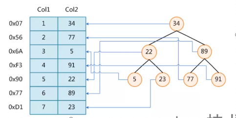
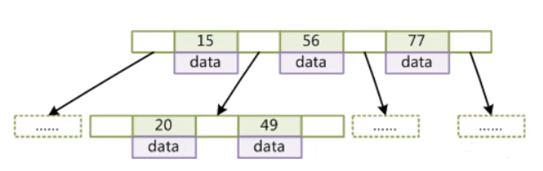
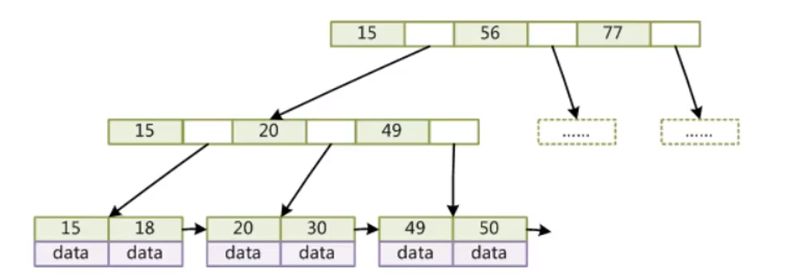
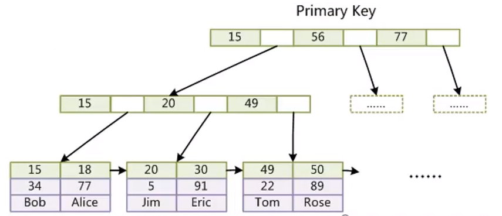
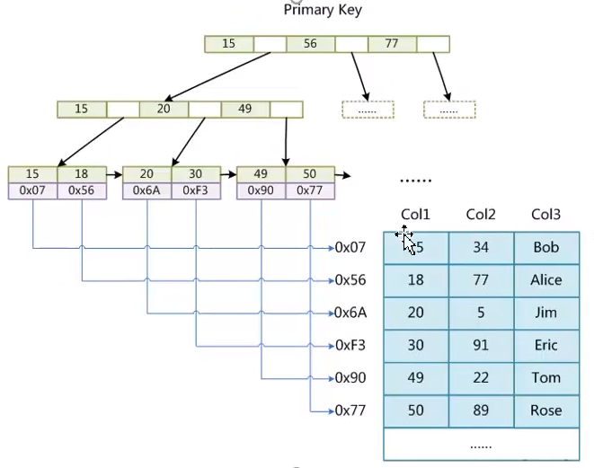

# 索引的本质

* 索引是帮助mysql高效获取数据的**排好序**的数据结构

* 索引储存在文件里

* 索引的结构

	* 二叉树
	* 红黑树()
	* HASH
	* BTREE

二叉树的缺点：如果数据递增，数只会向一方扩展

红黑树的缺点：数据的深度影响查询效率，数据越多树越深。2的n次方，n为数据的深度  

# 磁盘的存取原理

* 寻道速度（速度慢，费时）
* 旋转时间（速度较快）

# 索引底层数据结构与算法

* B-Tree

  * 度（Degree）-节点的存储数据个数
  * 叶节点具有相同的深度
  * 叶节点的指针为空
  * 叶节点的数据key从左到右递增排列

  

* B+Tree

  * 非叶子节点不存储data，只存储key，可以增大度
  * 叶子阶段不存储指针
  * 顺序访问指针，提高区间访问的性能

  

  

  叶子节点的大小默认16kb，单个索引字段bigint是8个字节，每个索引字段都有一个指针（下个节点在磁盘上的地址）默认6个字节

  树的高度控制在2-4之间，所以每次查找只需要操作几次磁盘io，所以非常快

* InnoDB索引实现（聚集）

  * 表结构分为两个文件frm(表结构文件)和ibd（索引和数据文件）
  * 表数据文件本身就是按B+Tree组织的一个索引结构文件
  * 聚集索引-叶节点包含了完整的数据记录
  * 为什么innoDB表必须有主键，并且推荐使用整形的自增主键？
  * 为什么非主键索引结构叶子节点存储的是主键值？（一致性和节省存储空间）
* 为什么存放数据的节点存放了下一个节点指针？（方便范围查找，只需要查找到起始值就可以向下查找到末尾）
  

  
* MyIsam索引实现（非聚集）

  * 表结构分为frm(表结构文件)和myi（索引文件）myd（数据文件）
  
  * 非聚集索引-索引文件和数据文件是分开的
  
    
  
  
  
* HASH 
  
  * hash是一种算法，适合等值查找不适合范围查找
