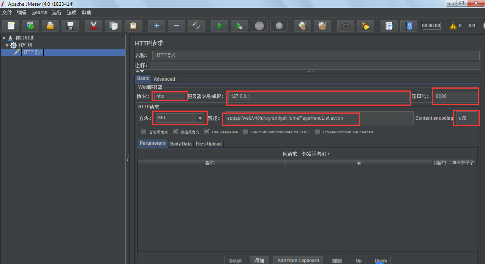

**一、Jmeter下载**

进入官网：http://jmeter.apache.org/

1.第一步进入官网如下图

 

2.选择进行下载，下载下来为一个压缩包，解压即可。

 

3.我下载的是jmeter4.0版本，对应jdk1.8。然后就进行解压。

个人认为要注意3点：

1）解压之后压缩包叫apache-jmeter-4.0.zip，如是src.zip后缀的都不对，打开之后会报错不可用，因为里面缺少我们下一步将要配置的环境变量.jar文件。

2）对应的jdk版本不可太低，一般jmeter3.0的对应jdk1.7，jmeter4.0对应jdk1.8以上，否者启用jmeter也会报错。

3）一定要确保环境变量配置正确（包括jdk的与jmeter的环境变量配置）。

好了，接下来进行环境变量配置吧，因为是新手所以参照了大佬们的教程，我就根据自己的实际遇到的情况，总结一下来做备忘。

 

**二、Jmeter环境变量相关配置**

 

1.）  电脑桌面----》“计算机”图标----》鼠标右键选择“属性”----》点击高级系统设置----》高级---》环境变量页面

 

 

2） 开始配置环境变量了。在系统变量框，点击“新建”，建立一个变量：JMETER_HOME,值为你解压的jmeter安装路径。我的安装路径是在E盘，这个路径根据自己实际安装路径进行填写。然后点击确定保存即可

 

 

3）配置classpath变量，没有的话也要按照上面步骤进行新建，有的话直接进行选中，点击编辑即可。变量值固定为：%JMETER_HOME%\lib\ext\ApacheJMeter_core.jar;%JMETER_HOME%\lib\jorphan.jar;%JMETER_HOME%\lib/logkit-2.0.jar; 做完之后一定要保存，不确定的话可以直接点击确定按钮直到退到我的电脑页面

 

 

4）基本配置完成，然后验证一下是否配置正确，是否可用。

首先进到你的jmeter安装路径，找到bin文件夹，点击进去，找到jmeter.bat，鼠标右键用管理员方式运行，或者直接双击打开，此时会弹出2个界面：1.个是命令窗口，使用jmeter的时候此命令窗口不能关，你缩小到电脑任务栏即可。2.还有一个界面是jmeter工作页面，你可以在里面进行相关的操作.具体如图

 

5）确认安装是否成功，双击jmeter.bat或者以管理员方式运行，页面如下：

 

6）jmeter的工作区域如下：，我们每次使用jmeter的首先打开方式就是进入bin文件下双击这个jmeter.bat，如果觉得麻烦，可以鼠标右键快捷方式发送电脑桌面，就会方便很多。

 

7.安装结束~

 

三、Jmeter测试案例实操

1、添加本次测试计划 （右键-->添加-->Threads（Users）-->线程组）

2、设置线程数 （所谓线程数就是并发用户数）

 

3、添加协议及相关配置信息

4、为线程添加监听器

5、启动测试

 

6、查看报告

查看结果树

聚合报告

图形结果

至此，本次测试教程基本完成！